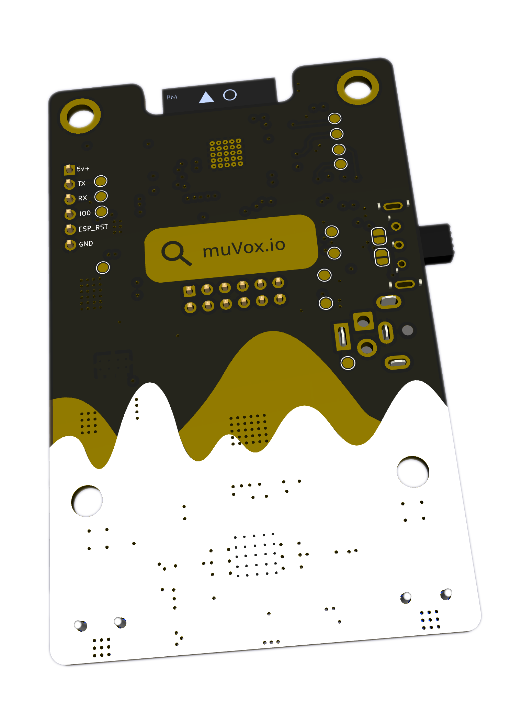
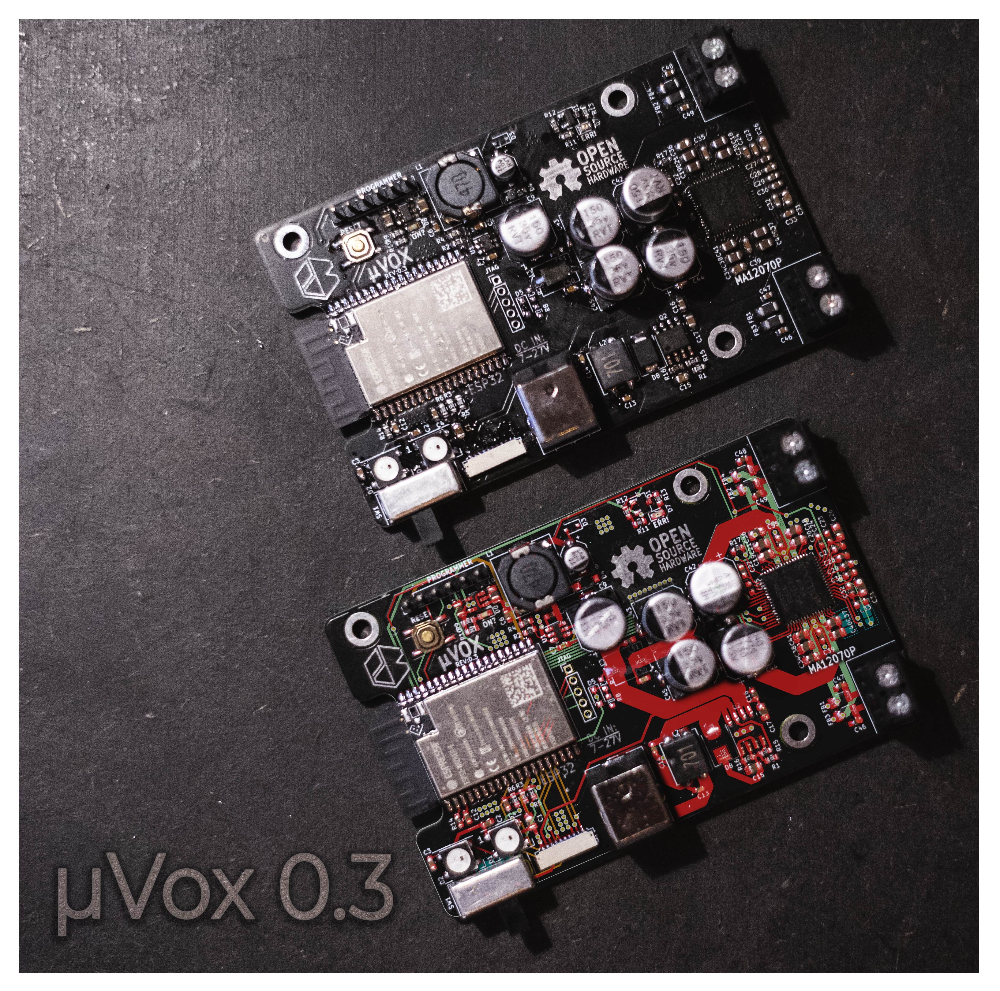

# µVox

Is an open source smart power audio amplifier, released under CC-BY-SA License.
Powered by the Merus MA12070P Amplifier 🔊 & an ESP32 Pico µC. 

- Designed in Denmark 🇩🇰 - proudly challengeing the status quo of the wellestablished Danish Audio Industry. 

This repository contains the KiCAD PCB project files for µVox. **Requires KiCAD 6.0**

## Goals

- To provide a truly plug and play amplifier solution to **any** speaker. 
- Allow **anybody** have a truly open audio streaming solution.
- Let this platform be flexible enough to live up any, and all, expectations for a fully digital smart amplfier. 
- Don't let anyone be stuck with a unusable device, even late in its product lifecycle.  

## Hardware Features

µVox is the first of several designs in our portfolio. We're eager to release our platform, and have thus opted to release our first, and certainly most minimal design, as a standing invitation for the comminunity to come join our open audio-endeavours.
µVox features the essential hardware necessary, for anyone to get started with open audio, this includes: 

- Audio Amplifier IC (Merus MA12070P)
  - 2 x 80W (@ 10% THD) or 2 x 35W (@ 1% THD), @ DC 26V input.
  - Supply Voltage 7-26V.
  - Multilevel Class-D Switching technology for unparalleled power efficiency.
    
- ESP32 Pico V3-02 Microprocessor Core
  - 8MB Flash + 2MB PSRAM
  - Wifi (2.4 GHz) & Bluetooth connectivity.
  - Single ceramic chip antenna design. 
  - Unlimited possibilities, with regards to functionality. Your fantasy is the limit!

- Onboard RGB Neo-Pixels for user feedback.

- JST Connector for option U/I board
  - Volume Up / Down buttons. 
  - Power / function button, with push-and-hold to power feature.

- Power Protection Circuit
  - Reverse polarity protection.
  - Short circuit protection.
  - Over voltage protection on both the PVDD (up to 26V) and DVDD (5V) rail.

- All the essential DC-DC power regulation.

- Connector for external USB/UART bridge, for programming the µC. 

## Software Features

Officially supported by 'Euphonium', the most sophisticated open source embedded audio streaming platform we've ever seen, µVox is able to not only do classic A2DP Bluetooth Audio Streaming and native webradio streaming, but also native Spotify Connect (yes, you read that right!). All of this functionality is bundled with a web-interface, hosted directly on the ESP, such that µVox is a stand-alone all-in-one open source streaming platform. 
See, FeelFreeLinux' repository for more details: https://github.com/feelfreelinux/euphonium
'Euphonium' is under rapid development, and as such isn't quite product-mature (as of mid March '22), but we're in daily contact with FeelFreeLinux, updating oneanother with the latest features and bug-fixes.

## How to get involved!

Join our matrix-room! We update the ESP32-Audio community there regularly, and are always open to input, and or questions, there. 
https://matrix.to/#/#esp32_audio:matrix.org

## Where can i get one!?

We'll be back shortly with an official public sales channel, soon as we're satisfied with the initial hardware. 
However if you're eager to get your hands on one NOW - reach out, and we might just consider you for our beta-tester team!

## As seen in!.. 

We're already involved with several companies, wanting to use the platform in their products.
We're happy to announce our collaboration with 'Lyd By Dissing', featured in their latest product 'STRØM' - an open source smart speaker. 
See: https://github.com/LydByDissing/stroem and https://stroem.readthedocs.io/en/latest/ for further details. 
And if you happen to speak danish, our article in the newspaper 'the engineer': https://ing.dk/artikel/saa-skal-bygges-ings-laesere-udvikler-helt-ny-open-source-hoejttaler-vaer-med-254857

Besides STRØM, we're also involved with Lennart Jarde' latest project. 
Coming from a background as a prestigious classical musician, and serious hi-fi tinkering, Lennart is now focussing on his magnum opus: 
http://ljweb.dk/Loudspeakers/project/project.html
Again, if you happen to speak danish: https://dmf.dk/news/lennart-jarde-et-todelt-liv

We have several more collaborations in the works, however none of which are public, just yet. Stay tuned!

## Current status
**(Late Mar. '22)**
Latest prototype boards have arrived, and are seemingly working. However - we're facing serious difficulty getting the PICO-IC's soldered properly, and as a result have managed to get two boards working so far. These, however, are working nicely. We're currently trying to figure out, how we can improve on the soldering difficulties. 

**(Early Apr. '22)**
After removing the PICO-IC off of several µVox's I've found that regardsless of how much I've reworked the chip from above (and how nice the solder joints might look from up top), the pins weren't sticking properly! Seemingly I must've had too much solder on the GND pad, lifting the chip slightly, such that the pins wound't connect. This lift, plus a significant amount of flux seemingly left the pins NC'd. After taking the IC off, I've (don't tell anyone! 😬) pretinned the bottom of the IC with my soldering iron, and reworked the IC back onto the board. As a result i now have 8 working boards 👍.
This solution clearly isn't viable, and for the next revision I'll be ordering a stencil, such that the PICO can be soldered with solder paste - which will hopefully mittigate the problem!. 

**(Summer '22)**
So.. The pico-core has been ditched, in favor of the good old WROVER module. So, we're now using a WROVER with 8MB PSRAM, and 16MB Flash. This has drastically improved the soldering process (as formerly mentioned). This change will also certainly make the future certification process signifianly easier, with regards to RF. 
We've added overvoltage protection on the PVDD rail (upto 26V) and overvoltage protection on the 5v0 rail. The 5v0 rail was causing overshooting issues in the earlier revision, causing the amplifier IC to blow, on some (few, luckily) powersupplies. The 'front-ui' connector has been changed to one with more pins. This allows us to have the I2C bus routed up to front panel (reasons for which will be revealed later!). A JTAG header and a PVDD monitoring-circuit (for battery-level) as also been added.

